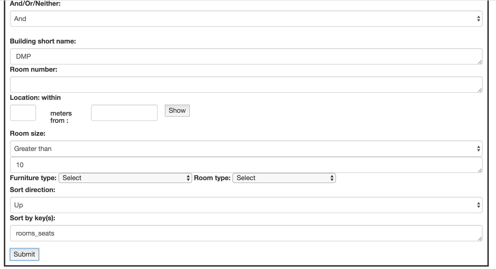

# Course Scheduler
This is a class project for practicing software engineering. This application consists of several parts:
1. Parse courses and rooms data from zipped text files into json objects. Throw errors if data is not valid.
2. Handle queries on courses and rooms and present data that satisfies the query. A sample query could be: "find courses in department X that has more than Y students". Throw erros if an invalid query is given.
3. Generate a class schedule that avoids as many contraints as possible. Some constraints are: a course must always take place at the same building, or a course could only happen on Tuesday/Thursday or Monday/Wednesday/Friday, etc.

## Sample results
a sample query on rooms and searched results.
<figure>
  
</figure>

<figure>
  
</figure>

a sample scheduling query and results
<figure>
  
</figure>

<figure>
  
</figure>

The above figure shows parts of the schedule. 

## Some highlights
1. Practiced writing unit tests to cover most codes.
<figure>
  
</figure>

2. Used a <a href="https://en.wikipedia.org/wiki/Flow_network" target="_blank">flow network</a> to solve the scheduling problem.

3. Used <a href="https://www.npmjs.com/package/request-promise" target="_blank">promises</a> instead of call backs to handle asynchronous operations (e.g. sending/receiving requests, unzipping files, etc).

## Project commands:
To build the project (note that Node (v6+) is required to run these commands):
1. ```yarn run clean```

1. ```yarn run configure```

1. ```yarn run build```

To start the server:

1. ```yarn run start```

1. open http://localhost:4321/

## Acknowledgement:
Thanks to Judy Chen for collaborating with me on this project.
